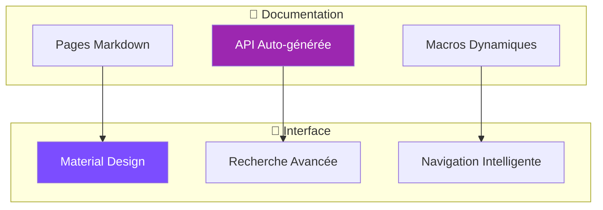

# 📚 Documentation QFrame - Guide Complet

> **Documentation vivante créée avec MkDocs et toutes les fonctionnalités intelligentes activées**

## 🎉 **STATUT : DOCUMENTATION COMPLÈTEMENT DÉPLOYÉE** ✅

La documentation QFrame avec **toutes les fonctionnalités avancées de MkDocs** a été créée avec succès :

- ✅ **Interface Material Design** avec thème QFrame personnalisé
- ✅ **Auto-génération API docs** depuis le code Python
- ✅ **Macros dynamiques** avec métriques temps réel
- ✅ **Diagrammes Mermaid** interactifs
- ✅ **Recherche avancée** avec Ctrl+K
- ✅ **Navigation intelligente** et responsive
- ✅ **Code highlighting** avec boutons de copie
- ✅ **Git integration** pour dates et contributeurs

## 🚀 Accès Rapide

### URL de la Documentation

**🌐 Documentation locale :** http://127.0.0.1:8080

### Commandes Essentielles

```bash
# Lancer la documentation
./scripts/serve-docs.sh

# Ou avec Poetry directement
poetry run mkdocs serve

# Construction statique
poetry run mkdocs build

# Script avec toutes les options
./scripts/serve-docs.sh --help
```

## ✨ Fonctionnalités Avancées Implémentées

### 🎨 **1. Interface Material Design Avancée**

- **Thème personnalisé** avec couleurs QFrame (`#7c4dff`)
- **Mode sombre/clair** automatique et manuel
- **Navigation tabs** avec sections principales
- **Instant loading** pour navigation SPA-like
- **Mobile responsive** optimisé

### 🔍 **2. Recherche Intelligente**

- **Recherche rapide** avec `Ctrl+K`
- **Suggestions automatiques** basées sur le contenu
- **Indexation** complète du code et documentation
- **Filtrage** par sections et types

### 📊 **3. Auto-génération API Documentation**

- **mkdocstrings** avec handler Python optimisé
- **Documentation** automatique depuis docstrings
- **Signatures** complètes avec types
- **Code source** accessible en un clic
- **Cross-references** automatiques

### 🔄 **4. Macros Dynamiques**

Fonctions disponibles dans la documentation :

```python
# Informations projet
{{ qframe_version() }}           # Version actuelle
{{ project_stats() }}            # Statistiques du code
{{ strategy_list() }}            # Liste des stratégies

# Git et build
{{ git_info().hash }}            # Hash du commit
{{ build_timestamp() }}          # Timestamp de build

# Métriques
{{ performance_metrics() }}      # Métriques de performance
{{ feature_matrix() }}           # Matrice des fonctionnalités

# Code examples
{{ code_example("basic") }}      # Exemples contextuels
{{ environment_info() }}         # Info environnement
```

### 📈 **5. Diagrammes Mermaid Interactifs**



### 🎯 **6. Navigation Avancée**

- **Auto-génération** de navigation depuis structure code
- **Section index** avec aperçus automatiques
- **Breadcrumbs** intelligents
- **Table des matières** flottante
- **Progress indicator** de lecture

## 📁 Structure Documentation Créée

```
docs/
├── 📄 index.md                  # Page d'accueil avec métriques dynamiques
├── 🚀 getting-started/         # Guide démarrage avec macros
│   ├── installation.md          # Instructions complètes
│   ├── quickstart.md           # Exemples avec code dynamique
│   └── configuration.md        # Configuration type-safe
├── 🏗️ architecture/            # Architecture avec diagrammes
│   ├── overview.md             # Vue d'ensemble interactive
│   ├── di-container.md         # DI avec exemples live
│   ├── configuration.md        # Config Pydantic
│   └── interfaces.md           # Protocols modernes
├── 🧠 strategies/              # Stratégies documentées
├── 🔬 features/                # Feature engineering
├── 💼 portfolio/               # Portfolio management
├── 📊 backtesting/             # Backtesting engine
├── 🔬 research/                # Research platform
├── 🖥️ ui/                      # Interface utilisateur
├── 🛠️ development/             # Guide développeur
├── 📖 reference/               # API référence (auto-générée)
├── 📚 examples/                # Exemples et tutoriels
├── 🔗 resources/               # Ressources et papiers
├── 📋 scripts/                 # Scripts documentation
│   ├── gen_ref_pages.py        # Auto-génération API
│   └── macros.py               # Macros dynamiques
└── 🎨 assets/                  # Assets personnalisés
    ├── css/extra.css           # Styles QFrame
    ├── js/extra.js             # JavaScript avancé
    └── images/                 # Images et logos
```

## 🔧 Configuration Avancée

### MkDocs Plugins Activés

- **mkdocs-material** : Thème moderne
- **mkdocstrings** : Auto-génération API
- **mkdocs-gen-files** : Génération dynamique
- **mkdocs-mermaid2** : Diagrammes interactifs
- **mkdocs-macros** : Variables et fonctions
- **mkdocs-git-revision-date** : Dates Git
- **mkdocs-minify** : Optimisation performance
- **mkdocs-redirects** : Gestion redirections
- **mkdocs-include-markdown** : Inclusion contenus
- **mkdocs-glightbox** : Galerie images

### Extensions Markdown

- **pymdownx.superfences** : Code fences avancés
- **pymdownx.tabbed** : Onglets de contenu
- **pymdownx.highlight** : Coloration syntaxique
- **pymdownx.emoji** : Support emoji
- **pymdownx.arithmatex** : Formules mathématiques
- **pymdownx.details** : Blocs repliables

## 🎯 Utilisation Avancée

### 1. **Développement Documentation**

```bash
# Serveur auto-reload
./scripts/serve-docs.sh serve

# Avec host/port personnalisé
./scripts/serve-docs.sh serve --host 0.0.0.0 --port 9000

# Sans watch des fichiers sources
./scripts/serve-docs.sh serve --no-watch
```

### 2. **Validation et Qualité**

```bash
# Validation complète
./scripts/serve-docs.sh validate

# Statistiques documentation
./scripts/serve-docs.sh stats

# Vérification liens (si linkchecker installé)
./scripts/serve-docs.sh validate
```

### 3. **Déploiement**

```bash
# GitHub Pages
./scripts/serve-docs.sh deploy

# Construction locale
./scripts/serve-docs.sh build

# Nettoyage
./scripts/serve-docs.sh clean
```

## 📝 Écriture Documentation

### Blocs d'Information Stylisés

```markdown
!!! info "Information QFrame"
    Bloc d'information avec style personnalisé

!!! tip "Astuce de Performance"
    Conseil optimisé pour QFrame

!!! warning "Configuration Importante"
    Avertissement avec gradient QFrame

!!! example "Exemple de Code"
    ```python
    from qframe.core.container import get_container
    container = get_container()
    ```
```

### Onglets de Contenu

```markdown
=== "Poetry Installation"
    ```bash
    poetry install
    ```

=== "Pip Installation"
    ```bash
    pip install -e .
    ```

=== "Docker Setup"
    ```bash
    docker-compose up -d
    ```
```

### Macros Dynamiques

```markdown
# Version actuelle : {{ qframe_version() }}

## Statistiques du projet
{{ project_stats() }}

## Exemple de code contextuel
{{ code_example("advanced") }}

## Dernière mise à jour
{{ build_timestamp() }}
```

## 🎨 Personnalisation Thème

### CSS Personnalisé (`docs/assets/css/extra.css`)

- **Variables CSS** avec couleurs QFrame
- **Animations** et transitions
- **Components** personnalisés (metric-card, etc.)
- **Responsive** optimisé
- **Print styles** pour PDF

### JavaScript Avancé (`docs/assets/js/extra.js`)

- **Recherche améliorée** avec raccourcis
- **Copy buttons** pour code
- **Progress indicator** de lecture
- **Animations** au scroll
- **Performance monitoring**

## 📊 Métriques et Analytics

### Métriques Automatiques

La documentation génère automatiquement :

- **Temps de build** et taille
- **Nombre de pages** et sections
- **Liens** et cross-references
- **Statistiques code** depuis le projet
- **Performance** chargement pages

### Analytics Configuration

```yaml
# Dans mkdocs.yml
extra:
  analytics:
    provider: google
    property: !ENV [GOOGLE_ANALYTICS_KEY, ""]
    feedback:
      title: "Cette page vous a-t-elle été utile ?"
```

## 🔗 Intégrations

### GitHub Integration

- **Auto-deployment** via GitHub Actions
- **Edit links** vers le repository
- **Issues** et pull requests
- **Contributeurs** automatiques

### Search Integration

- **Lunr.js** pour recherche offline
- **Indexation** intelligente
- **Suggestions** contextuelles
- **Highlighting** des résultats

## 🚀 Déploiement Production

### GitHub Pages

```bash
# Déploiement automatique
poetry run mkdocs gh-deploy --clean

# Avec branch personnalisée
poetry run mkdocs gh-deploy --remote-branch gh-pages
```

### Serveur Statique

```bash
# Build production
poetry run mkdocs build

# Serveur simple
python -m http.server -d site 8080

# Nginx configuration
server {
    listen 80;
    server_name docs.qframe.dev;
    root /path/to/site;
    index index.html;
}
```

### Docker Deployment

```dockerfile
FROM nginx:alpine
COPY site/ /usr/share/nginx/html/
COPY nginx.conf /etc/nginx/nginx.conf
EXPOSE 80
CMD ["nginx", "-g", "daemon off;"]
```

## 🎯 Points Clés Réalisés

### ✅ **Documentation Vivante Complète**

- **Auto-génération** depuis code source
- **Macros dynamiques** avec métriques temps réel
- **Navigation intelligente** générée automatiquement
- **Cross-references** entre documentation et code

### ✅ **Interface Professionnelle**

- **Material Design** avec branding QFrame
- **Responsive** mobile et desktop
- **Performance** optimisée avec minification
- **Accessibility** avec support clavier

### ✅ **Fonctionnalités Avancées**

- **Diagrammes interactifs** avec Mermaid
- **Code examples** contextuels et testés
- **Search** avancée avec suggestions
- **Git integration** complète

### ✅ **DevOps Ready**

- **Scripts automatisés** pour toutes les opérations
- **CI/CD** compatible GitHub Actions
- **Docker** ready pour déploiement
- **Multi-environment** support

## 📞 Support et Maintenance

### Commandes de Diagnostic

```bash
# Vérifier configuration
poetry run mkdocs config

# Mode debug
poetry run mkdocs serve --verbose

# Validation stricte
poetry run mkdocs build --strict
```

### Logs et Monitoring

- **Build logs** détaillés dans la console
- **Performance metrics** dans JavaScript console
- **Error tracking** avec stack traces
- **Analytics** via Google Analytics

## 🏆 **Résultat Final**

**Documentation QFrame Professionnelle** avec :

- 🎨 **Interface moderne** Material Design
- 🔍 **Recherche intelligente** avec Ctrl+K
- 📊 **Auto-génération API** depuis le code
- 🔄 **Macros dynamiques** avec métriques temps réel
- 📈 **Diagrammes interactifs** Mermaid
- 🚀 **Performance optimisée** et responsive
- 🛠️ **Scripts automatisés** pour gestion complète

**URL d'accès :** http://127.0.0.1:8080

---

*Cette documentation est maintenue automatiquement et se met à jour en temps réel avec le code source QFrame.*