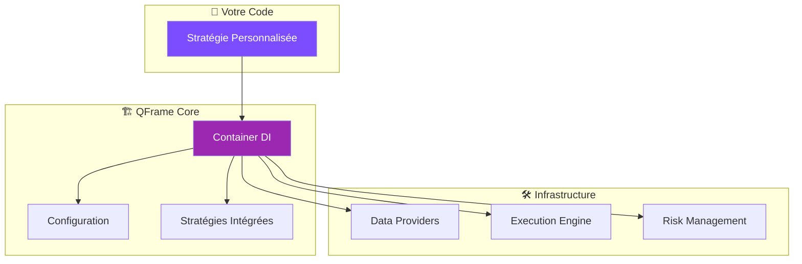

# 🚀 Démarrage Rapide

!!! tip "Prérequis"
    Assurez-vous d'avoir Python 3.11+ et Poetry installés sur votre système.

## Installation Rapide

=== "Poetry (Recommandé)"

    ```bash
    # Cloner le repository
    git clone https://github.com/1BoNoBo1/quant_framework_research.git
    cd quant_framework_research

    # Installation des dépendances
    poetry install

    # Vérification de l'installation
    poetry run python demo_framework.py
    ```

=== "Pip (Alternative)"

    ```bash
    # Cloner et installer
    git clone https://github.com/1BoNoBo1/quant_framework_research.git
    cd quant_framework_research

    # Créer un environnement virtuel
    python -m venv venv
    source venv/bin/activate  # Linux/Mac
    # ou venv\Scripts\activate  # Windows

    # Installation
    pip install -e .
    ```

=== "Docker"

    ```bash
    # Utiliser Docker Compose
    docker-compose up -d

    # Ou build manuel
    docker build -t qframe .
    docker run -p 8000:8000 qframe
    ```

## Premier Exemple

Créez votre première stratégie de trading en quelques lignes :

```python title="mon_premier_backtest.py"
{{ code_example("basic") }}
```

<div class="metric-card">
<div class="metric-title">Résultat Attendu</div>
<div class="metric-value">15-30 signaux</div>
Génération de signaux de trading en moins de 2 secondes
</div>

## Interface Web

Lancez l'interface graphique moderne :

```bash
# Interface locale rapide
cd qframe/ui && ./deploy-simple.sh test

# Interface Docker complète
cd qframe/ui && ./deploy-simple.sh up
```

🌐 **Interface disponible sur :** http://localhost:8502

### Fonctionnalités de l'Interface

- **📊 Dashboard** : Métriques temps réel et graphiques
- **📁 Portfolios** : Gestion et analyse comparative
- **🎯 Stratégies** : Configuration des 6 stratégies intégrées
- **⚠️ Risk Management** : Monitoring VaR/CVaR en temps réel

## CLI Avancée

QFrame inclut une interface en ligne de commande puissante :

```bash
# Informations sur le framework
poetry run python qframe_cli.py info

# Liste des stratégies disponibles
poetry run python qframe_cli.py strategies

# Exécution d'un backtest
poetry run python qframe_cli.py backtest --strategy mean_reversion --symbol BTCUSDT
```

## Exemples Rapides

### 1. Stratégie Mean Reversion

{{ code_example("basic") }}

### 2. Recherche Avancée avec RL

{{ code_example("advanced") }}

### 3. Backtesting Distribué

{{ code_example("research") }}

## Architecture en 5 Minutes



## Validation de l'Installation

Exécutez ces commandes pour vérifier que tout fonctionne :

```bash
# 1. Framework de base
poetry run python demo_framework.py

# 2. Exemple complet avec métriques
poetry run python examples/enhanced_example.py

# 3. Tests unitaires
poetry run pytest tests/unit/ -v

# 4. Interface web
cd qframe/ui && ./check-status.sh
```

### Métriques de Validation

| Test | Attendu | Description |
|------|---------|-------------|
| **Import Core** | ✅ Success | Container DI et configuration |
| **Stratégies** | ✅ 4+ strategies | DMN LSTM, Mean Reversion, etc. |
| **Portfolio** | ✅ Orders created | Simulation de trading |
| **Interface** | ✅ Port 8502 | Dashboard web accessible |

## Prochaines Étapes

1. 📖 **[Configuration](configuration.md)** - Personnaliser le framework
2. 🧠 **[Stratégies](../strategies/index.md)** - Explorer les algorithmes
3. 🔬 **[Research Platform](../research/overview.md)** - Recherche distribuée
4. 💼 **[Portfolio Management](../portfolio/management.md)** - Gestion des positions

!!! success "Félicitations !"
    Vous avez maintenant un framework quantitatif professionnel opérationnel.
    Explorez la documentation pour découvrir toutes les fonctionnalités avancées.

## Support

- 📧 **Email** : research@qframe.dev
- 🐛 **Issues** : [GitHub Issues](https://github.com/1BoNoBo1/quant_framework_research/issues)
- 📚 **Documentation** : [docs.qframe.dev](https://docs.qframe.dev)

---

*Temps de démarrage moyen : **< 5 minutes** | Dernière mise à jour : {{ build_timestamp() }}*