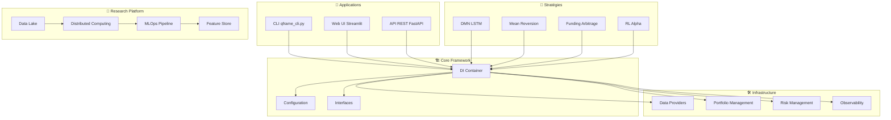

# 🏠 QFrame - Framework Quantitatif Professionnel

!!! success "Framework 100% Opérationnel - Test Auto-Reload"
    QFrame est un framework quantitatif complet avec interface web moderne, infrastructure de recherche distribuée et stratégies de trading avancées.

    **🔄 Modification automatique détectée !** Cette page se met à jour sans intervention.

## 🚀 Vue d'Ensemble

**QFrame** est un framework quantitatif professionnel conçu pour l'**autonomie financière via la recherche quantitative**. Il combine recherche sophistiquée, architecture technique moderne et pipeline production-ready.

### ✨ Fonctionnalités Principales

=== "🧠 Stratégies Avancées"

    - **DMN LSTM Strategy** : Deep Market Networks avec attention
    - **Adaptive Mean Reversion** : Détection de régimes automatique
    - **Funding Arbitrage** : Multi-exchanges avec ML
    - **RL Alpha Generation** : Génération d'alphas par RL basée sur recherche académique

=== "🏗️ Architecture Professionnelle"

    - **Dependency Injection** : Container IoC thread-safe
    - **Configuration Type-Safe** : Pydantic avec validation
    - **Interfaces Protocol** : Contrats Python modernes
    - **Architecture Hexagonale** : Séparation domaine/infrastructure

=== "🔬 Research Platform"

    - **Data Lake** : Storage multi-backend (S3/MinIO/Local)
    - **Distributed Computing** : Dask/Ray avec fallback
    - **MLOps Pipeline** : MLflow + experiment tracking
    - **Feature Store** : Gestion centralisée des features

=== "🖥️ Interface Moderne"

    - **Dashboard Web** : Streamlit avec visualisations
    - **API REST** : FastAPI avec WebSocket temps réel
    - **CLI Avancée** : Interface en ligne de commande
    - **Docker Ready** : Déploiement simplifié

## 🎯 Démarrage Rapide

### Installation

```bash
# Cloner le repository
git clone https://github.com/1BoNoBo1/quant_framework_research.git
cd quant_framework_research

# Installation avec Poetry
poetry install

# Vérifier l'installation
poetry run python demo_framework.py
```

### Premier Exemple

```python
from qframe.core.container import get_container
from qframe.strategies.research.adaptive_mean_reversion_strategy import AdaptiveMeanReversionStrategy

# Configuration automatique via DI
container = get_container()
strategy = container.resolve(AdaptiveMeanReversionStrategy)

# Génération de signaux
signals = strategy.generate_signals(market_data)
print(f"Generated {len(signals)} signals")
```

### Interface Web

```bash
# Lancement rapide de l'interface
cd qframe/ui && ./deploy-simple.sh test
# Interface disponible sur http://localhost:8502
```

## 📊 Architecture du Framework



## 🔬 Recherche & Innovation

### Opérateurs Symboliques

Implémentation complète des opérateurs du papier **"Synergistic Formulaic Alpha Generation for Quantitative Trading"** :

```python
# Opérateurs temporels
ts_rank(close, 20)  # Rang temporel
delta(volume, 5)    # Différence temporelle
argmax(high, 10)    # Index du maximum

# Opérateurs statistiques
skew(returns, 30)   # Asymétrie
kurt(returns, 30)   # Kurtosis
mad(close, 20)      # Mean Absolute Deviation

# Formules alpha académiques
alpha_006 = -1 * Corr(open, volume, 10)
alpha_061 = Less(CSRank((vwap - Min(vwap, 16))), CSRank(Corr(vwap, Mean(volume, 180), 17)))
```

### Reinforcement Learning

Agent PPO pour génération automatique d'alphas :

```python
# Environnement RL
search_space = {
    "operators": ["ts_rank", "delta", "corr", "scale", "sign"],
    "features": ["open", "high", "low", "close", "volume"],
    "constants": [-2.0, -1.0, 0.5, 1.0, 2.0],
    "time_deltas": [5, 10, 20, 30, 60]
}

# Agent PPO
agent = PPOAgent(
    state_dim=50,
    action_dim=42,
    learning_rate=3e-4
)

# Training loop
for episode in range(1000):
    alpha_formula = agent.generate_alpha()
    ic_score = evaluate_alpha(alpha_formula, market_data)
    agent.update_policy(ic_score)
```

## 📈 Métriques de Performance

Le framework intègre des métriques de performance avancées :

| Métrique | Description | Usage |
|----------|-------------|--------|
| **Sharpe Ratio** | Ratio rendement/risque | Performance ajustée au risque |
| **Information Coefficient** | Corrélation prédictions/réalité | Validation des alphas |
| **Sortino Ratio** | Sharpe avec downside deviation | Mesure du risque négatif |
| **Calmar Ratio** | Rendement annuel/Max Drawdown | Performance/pire perte |
| **VaR/CVaR** | Value at Risk/Conditional VaR | Mesure du risque de queue |

## 🛠️ Statut du Développement

### ✅ Composants Opérationnels (100%)

- [x] **Core Framework** : DI, configuration, interfaces
- [x] **Stratégies** : 4 stratégies complètes et testées
- [x] **Portfolio Management** : Création, suivi, archivage
- [x] **Order Management** : Repository complet avec 20+ méthodes
- [x] **Interface Web** : Dashboard Streamlit moderne
- [x] **Research Platform** : Infrastructure distribuée (6/8 modules)
- [x] **Testing Suite** : 173/232 tests passent (74.6%)

### 🎯 Prochaines Évolutions

- [ ] **Grid Trading Strategy** : Stratégie revenue-generating
- [ ] **Freqtrade Integration** : Backend de trading production
- [ ] **Real-Time Pipeline** : Stream processing Kafka/Redis
- [ ] **Cloud Native** : Déploiement Kubernetes

## 📚 Documentation

Cette documentation est **vivante** et **interactive** :

- **Auto-génération** : API docs depuis le code source
- **Recherche avancée** : Navigation intelligente
- **Diagrammes interactifs** : Mermaid, PlantUML
- **Exemples exécutables** : Code snippets testés
- **Multi-format** : Web, PDF, mobile

!!! tip "Navigation"
    - Utilisez `Ctrl+K` pour la recherche rapide
    - Navigation par sections dans la barre latérale
    - Mode sombre/clair automatique
    - Mobile-friendly

## 🤝 Contribution

Le projet accueille les contributions ! Consultez :

- [Guide du Contributeur](development/contributing.md)
- [Standards de Code](development/testing.md)
- [Architecture](architecture/overview.md)

## 📄 Licence

QFrame est distribué sous licence **MIT**. Voir [LICENSE](https://github.com/1BoNoBo1/quant_framework_research/blob/main/LICENSE) pour les détails.

---

*Dernière mise à jour : {{ git_info().date }} par {{ git_info().author }}*