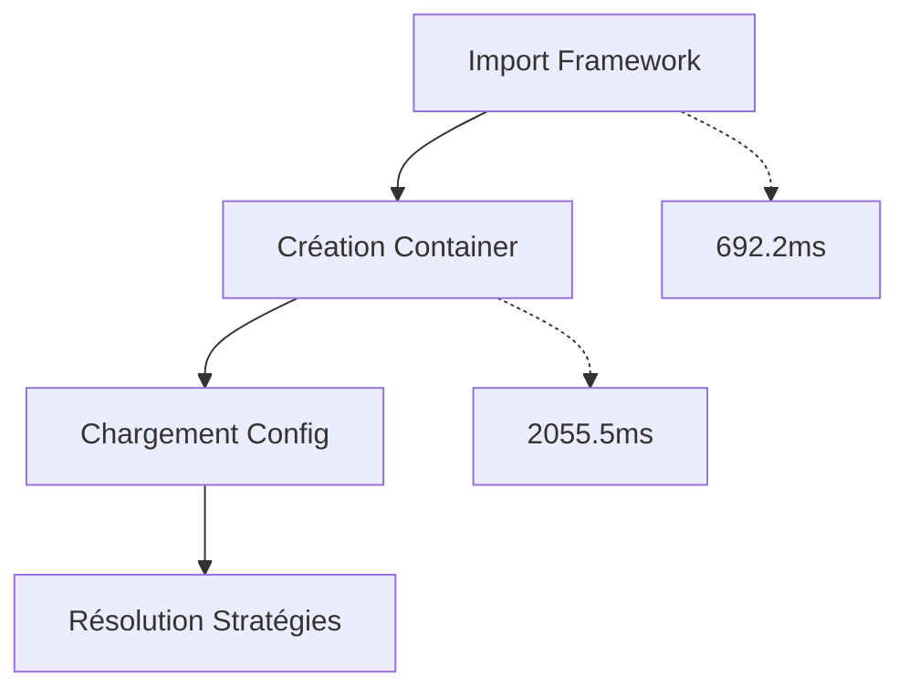

# 📊 Benchmarks Performance QFrame

**Dernière mise à jour** : 2025-09-29 13:37:25

## Métriques de Performance

### Temps d'Exécution

| Benchmark | Temps (ms) | Statut | Description |
|-----------|------------|--------|-------------|
| framework_import | 692.19 | ✅ | Temps d'import du framework core |
| di_container_creation | 2055.55 | ✅ | Temps de création du container DI |
| config_loading | 0.0 | ✅ | Temps de chargement configuration |
| strategy_resolution | 0 | ❌ | Temps de résolution stratégie Mean Reversion |

### Métriques Mémoire

**Mémoire initiale** : 746.16 MB

| Étape | Mémoire (MB) | Delta (MB) | Description |
|-------|--------------|------------|-------------|
| after_imports | 746.16 | 0.0 | Mémoire après imports core |
| after_container | 746.16 | 0.0 | Mémoire après création container |

## Informations Système

- **Framework** : QFrame v0.1.0
- **Python** : 3.13.3
- **Platform** : linux

## Recommandations Performance

⚠️ **Container DI** : Création lente (> 100ms). Vérifier enregistrements.
⚠️ **Mémoire** : Usage élevé (> 100MB). Optimiser imports.

## Graphiques

